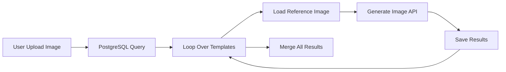

# N8N Workflow Integration - Staff Templates

## 📋 Resumen

La tabla `staff` almacena plantillas de prompts predefinidas para generación de imágenes con diferentes estilos de personaje (realistic y pixar). Esta integración permite generar múltiples versiones de una imagen con diferentes estilos mediante un loop en N8N.

## 🗄️ Estructura de la Tabla

```sql
CREATE TABLE staff (
    id SERIAL PRIMARY KEY,
    character_style VARCHAR(50) NOT NULL,
    imagePrompt TEXT NOT NULL,
    temperature FLOAT DEFAULT 0.7,
    maxOutputTokens INTEGER DEFAULT 2048,
    imageDataUrl2 VARCHAR(500),
    is_active BOOLEAN DEFAULT true,
    description TEXT,
    created_at TIMESTAMP DEFAULT CURRENT_TIMESTAMP,
    updated_at TIMESTAMP DEFAULT CURRENT_TIMESTAMP
);
```

## 📊 Datos Iniciales

| ID | character_style | temperature | imageDataUrl2 | is_active |
|----|----------------|-------------|---------------|-----------|
| 1  | realistic      | 0.45        | `/uploads/banana/test/generated_image_1759433366186.png` | true |
| 2  | pixar          | 0.55        | `/uploads/banana/test/generated_image_1759433366186.png` | true |

## 🔧 Configuración del Workflow N8N

### **Paso 1: PostgreSQL Node - Query Staff Templates**

**Node Type:** `Postgres`
**Operation:** `Execute Query`
**Connection:** PostgreSQL (`frontend_db`)

**Query SQL:**
```sql
SELECT
    id,
    character_style,
    imagePrompt,
    temperature,
    maxOutputTokens,
    imageDataUrl2,
    description
FROM staff
WHERE is_active = true
ORDER BY character_style;
```

**Output:**
```json
[
  {
    "id": 1,
    "character_style": "realistic",
    "imagePrompt": "TASK: Replace the character from image 2...",
    "temperature": 0.45,
    "maxOutputTokens": 2048,
    "imageDataUrl2": "/uploads/banana/test/generated_image_1759433366186.png",
    "description": "Template para fusión fotográfica realista..."
  },
  {
    "id": 2,
    "character_style": "pixar",
    "imagePrompt": "TASK: Replace the character from image 2...",
    "temperature": 0.55,
    "maxOutputTokens": 2048,
    "imageDataUrl2": "/uploads/banana/test/generated_image_1759433366186.png",
    "description": "Template para transformación estilo Pixar..."
  }
]
```

---

### **Paso 2: Loop Over Items Node**

**Node Type:** `Loop Over Items`
**Batch Size:** `1` (procesar un template a la vez)

**Input:** Output from PostgreSQL query (array de templates)

---

### **Paso 3: Read File Node - Load Reference Image**

**Node Type:** `Read Binary File` (or HTTP Request + Function)
**File Path:** `={{ $json.imageDataUrl2 }}`

**Propósito:** Cargar la imagen de referencia (layout) desde el path relativo almacenado en `imageDataUrl2`

**Alternativa con Function Node:**
```javascript
// Node: Function - Load Reference Image as Base64
const fs = require('fs');
const path = require('path');

// Path relativo desde la base de datos
const relativePath = $json.imageDataUrl2;

// Path absoluto (ajustar según el entorno)
const absolutePath = path.join('/app', relativePath);

// Leer archivo y convertir a base64
const imageBuffer = fs.readFileSync(absolutePath);
const base64Image = imageBuffer.toString('base64');

// Detectar MIME type
const ext = path.extname(absolutePath).toLowerCase();
const mimeTypes = {
  '.jpg': 'image/jpeg',
  '.jpeg': 'image/jpeg',
  '.png': 'image/png',
  '.gif': 'image/gif',
  '.webp': 'image/webp'
};

return {
  json: {
    ...item.json,
    imageDataUrl2_base64: base64Image,
    mimeType2: mimeTypes[ext] || 'image/jpeg'
  }
};
```

---

### **Paso 4: HTTP Request Node - Generate Image**

**Node Type:** `HTTP Request`
**Method:** `POST`
**URL:** `http://api_google:8001/api/v1/generate-image`
**Content-Type:** `application/json`

**Body (JSON):**
```json
{
  "imagePrompt": "={{ $json.imagePrompt }}",
  "imageDataUrl": "={{ $('Form Data').item.json.userUploadedImage }}",
  "mimeType": "image/jpeg",
  "imageDataUrl2": "={{ $json.imageDataUrl2_base64 }}",
  "mimeType2": "={{ $json.mimeType2 }}",
  "character_style": "={{ $json.character_style }}",
  "temperature": {{ $json.temperature }},
  "maxOutputTokens": {{ $json.maxOutputTokens }}
}
```

**Explicación de Campos:**
- `imagePrompt`: Prompt predefinido desde la base de datos (TASK completo)
- `imageDataUrl`: Imagen subida por el usuario (personaje a insertar)
- `mimeType`: Tipo MIME de la imagen del usuario
- `imageDataUrl2`: Imagen de referencia (layout) cargada desde el path
- `mimeType2`: Tipo MIME de la imagen de referencia
- `character_style`: Estilo del personaje (realistic o pixar)
- `temperature`: Temperatura específica para el estilo
- `maxOutputTokens`: Máximo de tokens para el estilo

---

### **Paso 5: Save Results Node**

**Node Type:** `Set` (or HTTP Request to save in database)
**Propósito:** Guardar los resultados de cada generación

**Output Structure:**
```json
{
  "template_id": "={{ $json.id }}",
  "character_style": "={{ $json.character_style }}",
  "generated_image_url": "={{ $json.candidates[0].content.parts[0].text }}",
  "timestamp": "={{ $now }}",
  "user_id": "={{ $('Form Data').item.json.userId }}"
}
```

---

## 🔄 Flujo Completo del Workflow



### **Descripción del Flujo:**

1. **User Upload Image** (Form Trigger)
   - Usuario sube una imagen (personaje a insertar)
   - Trigger: `/webhook/upload-image`

2. **PostgreSQL Query** (PostgreSQL Node)
   - Consulta: `SELECT * FROM staff WHERE is_active = true`
   - Output: Array de 2 templates (realistic y pixar)

3. **Loop Over Templates** (Loop Over Items Node)
   - Itera sobre cada template del resultado SQL
   - Batch size: 1 (procesa un template a la vez)

4. **Load Reference Image** (Function Node)
   - Lee el archivo desde `imageDataUrl2` path
   - Convierte a base64
   - Detecta MIME type

5. **Generate Image API** (HTTP Request Node)
   - POST a `http://api_google:8001/api/v1/generate-image`
   - Body con todos los parámetros del template
   - Combina imagen del usuario + imagen de referencia

6. **Save Results** (Set/HTTP Request Node)
   - Guarda cada imagen generada
   - Almacena metadatos (template_id, style, timestamp)

7. **Merge All Results** (Merge Node)
   - Combina todos los resultados del loop
   - Output: Array con todas las imágenes generadas

---

## 📝 Ejemplo de Uso Completo

### **Input (Usuario sube imagen):**
```json
{
  "userId": "user-123",
  "userUploadedImage": "data:image/jpeg;base64,/9j/4AAQSkZJRg...",
  "userUploadedMimeType": "image/jpeg"
}
```

### **PostgreSQL Output (Templates):**
```json
[
  {
    "id": 1,
    "character_style": "realistic",
    "imagePrompt": "TASK: Replace the character from image 2...",
    "temperature": 0.45,
    "maxOutputTokens": 2048,
    "imageDataUrl2": "/uploads/banana/test/generated_image_1759433366186.png"
  },
  {
    "id": 2,
    "character_style": "pixar",
    "imagePrompt": "TASK: Replace the character from image 2...",
    "temperature": 0.55,
    "maxOutputTokens": 2048,
    "imageDataUrl2": "/uploads/banana/test/generated_image_1759433366186.png"
  }
]
```

### **Final Output (Después del Loop):**
```json
[
  {
    "template_id": 1,
    "character_style": "realistic",
    "generated_image_url": "https://generativelanguage.googleapis.com/v1beta/files/abc123...",
    "timestamp": "2025-10-03T10:45:00Z"
  },
  {
    "template_id": 2,
    "character_style": "pixar",
    "generated_image_url": "https://generativelanguage.googleapis.com/v1beta/files/def456...",
    "timestamp": "2025-10-03T10:45:15Z"
  }
]
```

---

## 🔍 Queries Útiles para N8N

### **1. Obtener solo templates activos:**
```sql
SELECT * FROM staff WHERE is_active = true ORDER BY character_style;
```

### **2. Obtener template específico por estilo:**
```sql
SELECT * FROM staff WHERE character_style = 'realistic' AND is_active = true LIMIT 1;
```

### **3. Contar templates activos:**
```sql
SELECT character_style, COUNT(*) as total FROM staff WHERE is_active = true GROUP BY character_style;
```

### **4. Desactivar template:**
```sql
UPDATE staff SET is_active = false, updated_at = NOW() WHERE id = 1;
```

### **5. Agregar nuevo template:**
```sql
INSERT INTO staff (character_style, imagePrompt, temperature, maxOutputTokens, imageDataUrl2, is_active, description)
VALUES (
    'anime',
    'TASK: Create anime-style character...',
    0.60,
    2048,
    '/uploads/banana/test/reference_layout.png',
    true,
    'Template para estilo anime japonés'
);
```

---

## ⚙️ Configuración PostgreSQL en N8N

**Connection Details:**
- **Host:** `db` (Docker network)
- **Port:** `5432`
- **Database:** `frontend_db`
- **User:** `postgres`
- **Password:** `password` (según docker-compose.yml)
- **SSL Mode:** `disable` (desarrollo local)

---

## 🎯 Beneficios de Esta Arquitectura

✅ **Separación de Responsabilidades:**
- N8N: Orquestación y flujo de trabajo
- API Google: Generación de imágenes
- PostgreSQL: Almacenamiento de templates

✅ **Escalabilidad:**
- Agregar nuevos estilos sin modificar código
- Solo insertar nuevo registro en `staff`

✅ **Mantenibilidad:**
- Prompts centralizados en base de datos
- Fácil actualización de templates
- Control de activación/desactivación

✅ **Flexibilidad:**
- Parámetros específicos por estilo (temperature, tokens)
- Rutas relativas para imágenes de referencia
- Soporte para múltiples layouts

✅ **Trazabilidad:**
- Timestamps automáticos (created_at, updated_at)
- Descripciones detalladas por template
- Fácil auditoría de cambios

---

## 📊 Próximos Pasos (Opcional)

### **1. Agregar más estilos:**
```sql
INSERT INTO staff (character_style, imagePrompt, temperature, maxOutputTokens, imageDataUrl2, is_active, description)
VALUES
('anime', 'TASK: Create anime-style character...', 0.60, 2048, '/uploads/ref/anime_layout.png', true, 'Anime japonés'),
('comic', 'TASK: Create comic book character...', 0.65, 2048, '/uploads/ref/comic_layout.png', true, 'Comic americano'),
('watercolor', 'TASK: Create watercolor painting...', 0.70, 2048, '/uploads/ref/watercolor_layout.png', true, 'Acuarela artística');
```

### **2. Versioning de templates:**
```sql
ALTER TABLE staff ADD COLUMN version INTEGER DEFAULT 1;
ALTER TABLE staff ADD COLUMN parent_template_id INTEGER REFERENCES staff(id);
```

### **3. Métricas de uso:**
```sql
CREATE TABLE staff_usage (
    id SERIAL PRIMARY KEY,
    staff_id INTEGER REFERENCES staff(id),
    user_id VARCHAR(255),
    execution_time_ms INTEGER,
    success BOOLEAN,
    error_message TEXT,
    created_at TIMESTAMP DEFAULT CURRENT_TIMESTAMP
);
```

---

**Última actualización:** 2025-10-03
**Versión:** 1.0
